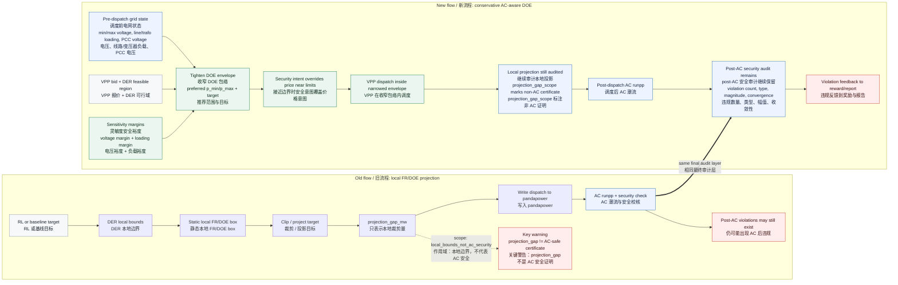

# AC-Aware DOE Flow Contrast / AC 感知 DOE 流程对比

This visualization records the UI/documentation view of the implemented DOE
safety-flow change. The document itself is a visualization asset; the simulator
now emits the `ac_aware_*` fields shown below.

本图示记录已经实现的 DOE 安全流程变更。本文档本身只是可视化资产；仿真器现在会输出下方展示的
`ac_aware_*` 字段。

## Before vs After / 修改前 vs 修改后

## Flow Semantics / 流程语义

| Step | English label | 中文标签 | Meaning |
| --- | --- | --- | --- |
| 1 | Local FR/DOE projection | 本地 FR/DOE 投影 | Clips aggregate targets against DER/VPP local feasible bounds. It is a dispatch feasibility repair, not a network security certificate. |
| 2 | `projection_gap_mw` | `projection_gap_mw` 投影差值 | Measures how far the requested target was moved by local projection. A zero value does not prove AC voltage or thermal safety. |
| 3 | Pre-dispatch grid state | 调度前电网状态 | Runs/reads the latest grid state before issuing new DOE guidance, including voltage and loading pressure. |
| 4 | Sensitivity margins | 灵敏度安全裕度 | Uses voltage/loading margins to conservatively narrow the DOE before dispatch. This reduces the chance that a locally feasible action becomes AC-infeasible. |
| 5 | Conservative AC-aware DOE | 保守 AC 感知 DOE | The issued operating envelope is no longer only price/local-bound guided; near security limits it becomes tighter and grid-security driven. |
| 6 | Post-AC security check | 调度后 AC 安全校核 | Remains mandatory after dispatch. Violations are still recorded even when the DOE was narrowed. |

## Audit Field Mapping / 审计字段映射

| Artifact / 资产 | Fields / 字段 | Visualization role / 图示含义 |
| --- | --- | --- |
| `projection_trace` | `projection_gap_mw`, `local_bounds_projection_gap_mw`, `projection_gap_scope` | Shows local projection magnitude and explicitly labels that the scope is not an AC security guarantee. |
| `dso_operating_envelope` | `network_min_vm_pu`, `network_max_vm_pu`, `network_max_line_loading_percent`, `network_max_trafo_loading_percent`, `pcc_vm_pu` | Shows the pre-dispatch grid state used to shape the DOE. |
| `dso_operating_envelope` | `preferred_p_min_mw`, `preferred_p_max_mw`, `preferred_target_p_mw`, `grid_pressure_mode`, `ac_aware_grid_pressure_mode`, `grid_priority_over_price` | Shows how the conservative DOE is tightened and when grid security overrides price. |
| `dso_operating_envelope` | `ac_aware_enabled`, `ac_aware_status`, `ac_aware_reason`, `ac_aware_original_p_min_mw`, `ac_aware_original_p_max_mw`, `ac_aware_p_min_mw`, `ac_aware_p_max_mw`, `ac_aware_shrink_lower_mw`, `ac_aware_shrink_upper_mw` | Shows whether finite-difference sensitivity tightened the operating envelope and by how much. |
| `projection_trace` | stage `ac_aware_doe` | Shows the extra projection stage between local FR/DOE clipping and pandapower dispatch. |
| `fr_envelope_state` | `safety_margin`, local P/Q bounds | Shows the visible FR/DOE envelope and any configured conservative local margin. |
| reward/report outputs | `post_ac_violation_count`, `post_ac_voltage_violation_count`, `post_ac_line_overload_count`, `post_ac_trafo_overload_count`, `post_ac_violation_magnitude`, `post_ac_powerflow_failed` | Keeps post-AC audit visible after the new envelope logic. |

## One-Line Caption / 图注

**English:** The old projection gap only measured local FR/DOE clipping; the new
conservative DOE first reads pre-dispatch grid pressure and applies AC-aware
sensitivity margins, while post-AC violations remain the final audit signal.

**中文：** 旧版 `projection_gap` 只度量本地 FR/DOE 裁剪量；新版保守 DOE 先读取调度前电网压力并叠加
AC 感知灵敏度裕度来收窄包络，同时继续把调度后 AC 违规作为最终审计信号。
