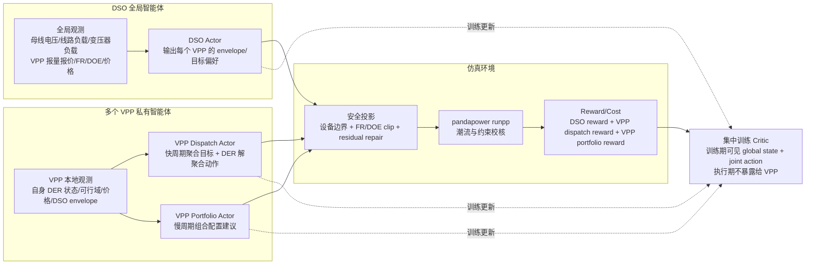
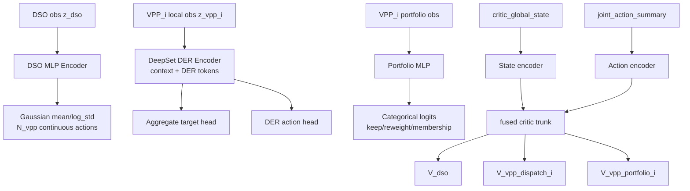
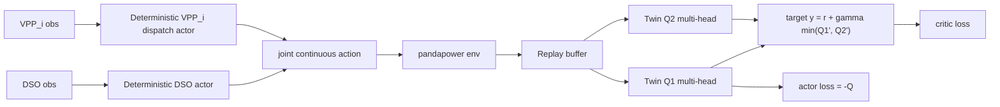
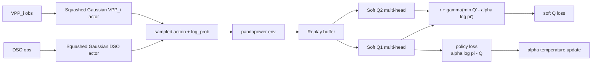

# HASAC / HAPPO / MATD3 与 Baseline 机制报告

生成日期：2026-05-09  
对应实验：`outputs/paper_training_long_current`  
对应配置：`configs/european_lv_benchmark_v2.yaml`  

## 1. 实验批次概览

本轮 `paper_long` 实验已经完成完整训练与冻结评估闭环：

| 项目 | 数值 |
|---|---:|
| 总任务数 | 285 |
| Baseline rollout | 45 |
| 训练 checkpoint | 60 |
| Frozen evaluation | 180 |
| Seeds | 9401, 9402, 9403, 9404, 9405 |
| 训练场景 | `train_mixed` |
| 评估场景 | `holdout_peak`, `holdout_cloudy`, `holdout_reverseflow` |
| 每个 episode / eval horizon | 672 steps |
| step 尺度 | 15 min |
| 每个训练 run | 120 episodes |
| 主网络 hidden dim | 256 |
| 学习率 | 3e-4 |
| replay batch size | 256 |

全 holdout 平均结果：

| 算法 | 平均 eval reward | 平均 total cost | 平均越限单元 | 安全通过率 |
|---|---:|---:|---:|---:|
| `rule_based` | -116070.77 | 2338215.36 | 0.00 | 1.000 |
| `no_flex` | -120441.23 | 2425624.62 | 0.00 | 1.000 |
| `opf_oracle_proxy` | -122733.62 | 2471367.11 | 29.67 | 0.467 |
| `HASAC` | -134213.03 | 2700014.27 | 31.55 | 0.667 |
| `HAPPO` | -135700.59 | 2746137.70 | 7.97 | 0.750 |
| `MATD3` | -138523.62 | 2786059.74 | 16.85 | 0.750 |

结论：本轮实验验证了深度强化学习闭环可运行，但当前训练策略没有超过规则基线。主要问题不是训练没有跑通，而是 reward 尺度、AC 安全可行域、checkpoint 选择与泛化训练设计仍需升级。

## 2. 总体智能体架构



隐私边界：

- DSO actor 使用 DSO 可见的全局网络状态、VPP 报量报价、FR/DOE 和市场价格。
- 每个 VPP dispatch actor 只使用自身 VPP 的本地 DER 状态、自己的 envelope 和价格信号。
- VPP 之间不共享 DER 私有状态。
- critic 属于 CTDE 的训练期对象，不是执行期调度对象。

## 3. Baseline 设计

### 3.1 `rule_based`

`rule_based` 使用 `Simulator.step(actions=None)` 的默认流程：

1. 每个 step 读取 price/load/PV profile。
2. 每个 VPP 上报 day-ahead bid。
3. DSO 基于 VPP bid、FR 可行域和当前价格生成 operating envelope。
4. 若无外部 action，则使用 envelope 的 `preferred_target_p_mw`。
5. VPP 用规则式 `disaggregate_target_by_rule` 将聚合目标分解到 DER。
6. 写入 pandapower，运行潮流，记录 reward/cost/violations。

DSO envelope 的价格逻辑：

| 价格区间 | service request | preferred target |
|---|---|---|
| `price <= 55` | absorb_or_charge | 靠近 `p_min` |
| `55 < price < 100` | balanced_operation | 可行域中点 |
| `price >= 100` | export_or_reduce_load | 靠近 `p_max` |

本轮结果中 `rule_based` 是最强 baseline：平均 reward `-116070.77`，安全通过率 `1.0`。

### 3.2 `no_flex`

`no_flex` 不主动调用灵活性：

```text
target_p_mw = vpp.current_power_mw()
```

它用于衡量“不使用 VPP 灵活性”的保守运行效果。本轮 `no_flex` 安全通过率也是 `1.0`，说明场景本身在保守运行下较安全，灵活性调度若设计不好反而会增加成本和越限。

### 3.3 `opf_oracle_proxy`

当前 `opf_oracle_proxy` 不是完整 AC OPF，也不是 MILP 市场出清。它是 full-information 启发式代理：

```text
if price >= 105: target = p_max
elif price <= 55: target = p_min
else: target = 0.5 * (p_min + p_max)
```

这解释了为什么它并不总是强于 `rule_based`，并且在 reverseflow 场景中可能带来电压/线路越限。论文中不能把它称为真正 oracle，只能称为 oracle proxy。

## 4. HAPPO 结构

HAPPO 是 on-policy、CTDE、异质多智能体 PPO 类方法。本项目实现重点：

- DSO actor：连续高斯策略，输出每个 VPP 的全局引导动作。
- VPP dispatch actor：连续高斯策略，输出聚合目标偏置和 DER 级动作。
- VPP portfolio actor：离散 Categorical 策略，慢周期输出 `keep / reweight / propose_membership_change`。
- centralized value critic：训练期使用 global critic state + joint action summary，输出多头 value。
- sequential update：按角色顺序更新，并用 importance correction 修正其他 agent 策略变化带来的分布漂移。

结构图：



核心损失：

```text
A_t = GAE(r_t, V_t, gamma=0.97, lambda=0.95)
ratio = pi_new(a_t | o_t) / pi_old(a_t | o_t)
L_actor = - E[min(ratio * A_t, clip(ratio, 1-eps, 1+eps) * A_t)]
          - entropy_coef * H(pi)
L_value = MSE(V_head, normalized_return_head)
```

本轮参数：

- `ppo_clip_ratio = 0.20`
- `ppo_epochs = 4`
- `entropy_coef = 0.01`, `higher_entropy = 0.03`
- `importance_correction_clip = 2.0`
- `portfolio_decision_interval_steps = 24`

本轮表现：

- HAPPO 是三个 RL 中安全性相对较好的一个，平均越限 `7.97`。
- 但平均 cost 比 rule_based 高约 `17.45%`。
- `higher_entropy` 与 `lower_lr` 比 base 略好，说明探索和学习率调低有帮助。

## 5. MATD3 结构

MATD3 是 off-policy、deterministic actor、twin Q critic 的多智能体 TD3 变体。本项目中 MATD3 只覆盖连续控制部分：

- DSO continuous actor。
- 每个 VPP 一个 dispatch actor。
- 不训练 portfolio actor，portfolio 维持 keep。
- replay buffer 存储 `(obs, joint_action, reward_vector, next_obs, done)`。
- twin critic 输出 DSO head + 每个 VPP dispatch head。
- target network、target policy smoothing、delayed actor update 均已实现。

结构图：



核心损失：

```text
y_role = r_role + gamma * min(Q1_target(s', a'), Q2_target(s', a'))
L_critic = MSE(Q1(s,a), y_role) + MSE(Q2(s,a), y_role)
L_actor = - E[dso_coef * Q_dso + dispatch_coef * mean(Q_vpp_dispatch)]
```

本轮参数：

- `exploration_noise = 0.15`
- `policy_noise = 0.10`
- `noise_clip = 0.30`
- `policy_delay = 2`
- `tau = 0.01`
- `warmup_steps = 2000`

本轮表现：

- MATD3 训练 reward 在部分 seed 上提升明显，但 holdout 泛化最差。
- 平均 cost 比 rule_based 高约 `19.15%`。
- reverseflow 场景下平均越限较高，说明 deterministic policy 容易学到激进动作。

## 6. HASAC 结构

HASAC 是 off-policy、stochastic actor、soft actor-critic 类方法。本项目实现：

- DSO stochastic actor。
- 每个 VPP dispatch stochastic actor。
- centralized twin soft Q critic，多头输出 DSO + 每个 VPP dispatch。
- replay buffer。
- automatic entropy temperature tuning。
- soft target backup。
- 当前不训练 portfolio actor。

结构图：



核心损失：

```text
y_role = r_role + gamma * (min(Q1_target, Q2_target) - alpha * log pi(a'|s'))
L_Q = MSE(Q1(s,a), y_role) + MSE(Q2(s,a), y_role)
L_pi = E[alpha * log pi(a|s) - Q(s,a)]
L_alpha = - alpha * (log pi + target_entropy)
```

本轮表现：

- HASAC 平均 reward 是三个 RL 中最好的，但仍比 rule_based 差约 `15.63%`。
- HASAC reverseflow 越限最严重，平均 reverseflow 越限 `84.65`。
- `base` 与 `higher_entropy` 结果完全相同，说明当前 `higher_entropy` override 没有真正作用到 HASAC 的 target entropy / alpha 设置，这是需要修复的实验缺口。

## 7. Reward 与 Cost 计算机制

### 7.1 DSO cost

DSO 计算 `total_cost`：

```text
C_total =
  C_operation
+ C_tracking
+ C_projection
+ C_comfort
+ C_soc
+ C_voltage
+ C_line
+ C_trafo
+ C_powerflow
```

各项含义：

```text
C_operation =
  abs(P_ext_grid_mw) * price                 if privacy_preserving_proxy
  sum(VPP operating_cost)                    otherwise

C_tracking = 100 * target_tracking_error^2

C_projection = 250 * projection_gap_mw^2 + 2 * projection_count

C_voltage = sum(10000 * voltage_violation_magnitude^2)

C_line = sum(5 * line_overload_magnitude^2)

C_trafo = sum(5 * transformer_overload_magnitude^2)

C_powerflow = 1000 if runpp not converged else 0
```

HVAC 舒适度惩罚：

```text
error = indoor_temp - setpoint
hard = max(0, temp_min - indoor_temp) + max(0, indoor_temp - temp_max)
C_hvac = a * error^2 + b * abs(error) + 100 * hard^2
C_comfort = sum(C_hvac over HVAC DER)
```

DSO reward：

```text
r_dso = -0.05 * C_total + feasibility_bonus + tracking_bonus

feasibility_bonus = 1 if no constraint violation else 0
tracking_bonus = 0.25 / (1 + target_tracking_error)
```

注意：本轮 `total_cost` 绝大多数来自 HVAC comfort penalty，而不是购电成本。

### 7.2 VPP dispatch reward

VPP dispatch reward 是本地私有收益代理，不直接加入 raw global DSO reward：

```text
energy_market_revenue = price * delivered_p_mw * dt_hours

flexibility_service_payment =
  FLEXIBILITY_SERVICE_PRICE_MULTIPLIER * price * service_quantity_mw * dt_hours

availability_payment =
  AVAILABILITY_PAYMENT_RATE * price * flex_span_mw * dt_hours

private_profit_proxy =
  energy_market_revenue
+ flexibility_service_payment
+ availability_payment
- der_operation_cost
```

最终 dispatch reward：

```text
r_dispatch =
  0.02 * private_profit_proxy
+ 0.50 * preferred_region_score
- 25.0 * tracking_gap_mw^2
- 5.0 * projection_gap_mw
- 10.0 * projection_gap_mw^2
- 0.001 * comfort_soc_penalty
```

符号说明：

- `delivered_p_mw > 0` 表示 VPP 向电网注入。
- `delivered_p_mw < 0` 表示 VPP 从电网吸收。
- 当 service request 是 `absorb_or_charge` 时，服务量取 `max(0, -p_mw)`。
- 当 service request 是 `export_or_reduce_load` 时，服务量取 `max(0, p_mw)`。

### 7.3 VPP portfolio reward

Portfolio agent 是慢周期组合配置智能体，它不直接拿 raw DSO reward，而是拿局部化 DSO alignment 信号：

```text
r_portfolio =
  0.10 * private_profit_proxy
+ localized_dso_alignment_reward
+ reliability_bonus
- switching_cost
- delivery_risk_penalty
```

其中：

```text
localized_dso_alignment_reward =
  0.35 * preferred_region_score
+ 0.25 * feasibility_bonus
+ 0.15 * availability_quality
+ 0.10 * reliability_bonus
- 0.001 * network_penalty

switching_cost =
  0.00 for keep
  0.02 for reweight
  0.08 for propose_membership_change

delivery_risk_penalty =
  0.50 * projection_gap_mw + 0.20 * tracking_gap_mw
```

当前 portfolio action 仍受物理安全门控，商业组合建议会记录，但不允许神经网络直接移动 pandapower 物理元件。

## 8. Cost / Reward 为什么是负数

当前 DSO reward 本质是成本的负数缩放：

```text
r_dso ~= -0.05 * total_cost
```

所以只要系统有购电成本、舒适度成本、SOC 惩罚或越限惩罚，reward 大概率就是负数。负 reward 本身不是错误；关键是相对大小。

本轮最重要的问题是：

```text
comfort_violation_penalty >> procurement_proxy_cost >> network_violation_penalty
```

抽查 `hasac_base_train_mixed_seed_9403_eval_holdout_reverseflow`：

| 项 | 数值 |
|---|---:|
| total_cost | 2692741.25 |
| comfort_violation_penalty | 2661920.79 |
| procurement_proxy_cost | 28205.61 |
| soc_violation_penalty | 2545.43 |
| voltage_violation_penalty | 68.48 |
| line_overload_penalty | 0.94 |

这说明当前训练更容易被 HVAC 舒适度项主导，而不是学出真正优秀的配电网调度策略。

## 9. 本轮实验暴露的问题

1. `rule_based` 比所有 RL 方法都强，说明 RL 策略还没有形成有效优势。
2. `no_flex` 也很强，说明当前灵活性调用的增益空间小，错误调度更容易带来额外成本。
3. reward 尺度严重不平衡，HVAC comfort penalty 主导训练。
4. reverseflow 场景下 AC 安全约束不足，RL 产生较多电压越限。
5. 当前 safety projection 主要是 DER/FR/DOE 局部投影，不是完整 AC OPF projection。
6. HASAC 的 `higher_entropy` case 没有真正改变 HASAC entropy 机制。
7. 使用 final checkpoint 做 eval 不一定合理，部分 run 的 best episode 明显好于 final episode。
8. `opf_oracle_proxy` 不是完整 oracle，不能支撑最优性结论。

## 10. 建议的下一步技术路线

优先级从高到低：

1. 将 reward 做量纲归一化，拆分 report 中的 DSO cost、VPP profit、comfort、security。
2. 引入 validation-best checkpoint，而不是 final checkpoint。
3. 修复 HASAC entropy override：支持 target entropy、alpha init、alpha clamp。
4. 将训练集扩展为 mixed + peak + cloudy + reverseflow curriculum。
5. 将 DSO operating envelope 从价格启发式升级为 AC sensitivity / OPF-aware envelope。
6. 将 safety projection 升级为 AC-aware projection，至少考虑关键母线电压灵敏度和线路 loading margin。
7. 对 comfort penalty 做物理校准，避免 HVAC 项吞噬所有经济调度信号。
8. 用真正 AC OPF 或 MILP 经济调度替代 `opf_oracle_proxy`。

