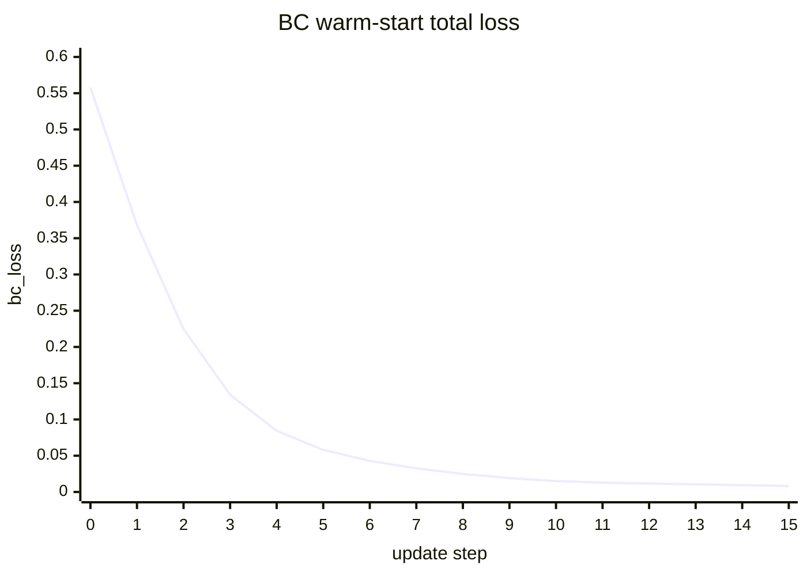
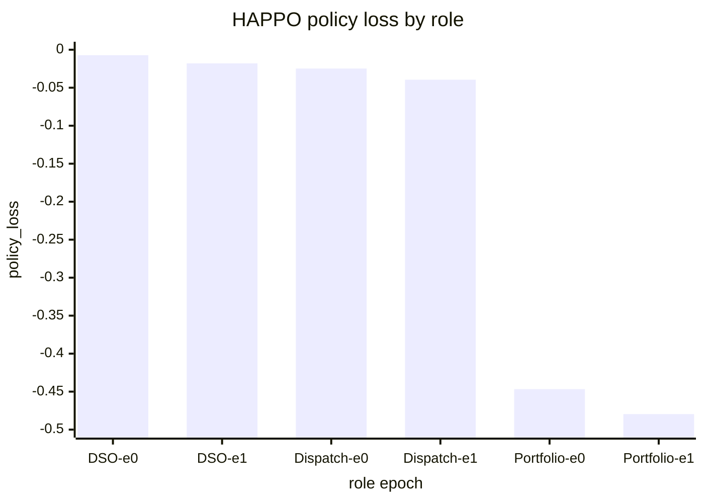

# DSO 敏感度注意力改造与实验详细报告

Updated: 2026-05-28 Asia/Shanghai

本文档是本轮 `sensitivity_attention_v1` 改造的中文总报告，用于长期保留：

- 改造前后的算法结构变化；
- 每个关键模块改了什么、为什么改；
- 实验命令、配置、seed、输出目录；
- reward、loss、KL、entropy、grad norm、projection gap、AC 安全指标的文件位置；
- 当前结果能说明什么、不能说明什么；
- paper-long 之前仍需谨慎的风险。

原始大文件保存在 `outputs/`；为了方便 GitHub 版本化，关键小型 CSV/JSON 已同步到
`docs/experiments/dso_sensitivity_attention_artifacts/`。

## 1. 改造目标

原始 DSO `dso_operating_envelope` 更接近固定规则外壳：根据 FR/DOE、bid、潮流状态给 VPP
生成 preferred range。它能保安全，但不是一个可训练的 DSO 全局智能体。

本轮目标是新增一个可训练但仍受安全边界约束的 DSO actor：

```text
ActionUnit x NetworkObject sensitivity-aware bipartite-attention DSO actor
```

含义如下：

- `ActionUnit`：DSO 可以引导的动作单元，例如 VPP-PCC 或 VPP-bus 聚合功率通道。
- `NetworkObject`：配电网中被关注的物理对象，例如低电压 bus、高电压 bus、重载 line、重载 transformer。
- `sensitivity`：用 pandapower finite difference 估计“某个 ActionUnit 改变功率时，某个 NetworkObject 状态如何变化”。
- `bipartite attention`：让 DSO actor 在“可调动作单元”和“受影响网络对象”之间学习注意力关系。
- `safe decoder`：神经网络只输出 center/width/direction/lambda 等软引导参数，最终必须经过 FR/DOE 和 AC-aware safety 边界解码，不能直接输出硬安全边界。

## 2. 改造前后结构对比

| 层级 | 改造前 | 改造后 | 作用 |
|---|---|---|---|
| DSO envelope policy | `rule_v0` 固定规则 | `rule_v0` 保留，新增 `sensitivity_attention_v1` | 不破坏 baseline，同时允许 DSO actor 学习 |
| DSO observation | legacy flat vector | legacy flat 保留，新增 structured bipartite flat spec | 让 HAPPO 可以接入结构化 DSO 输入 |
| DSO actor | legacy MLP Gaussian | legacy MLP 保留，新增 structured HAPPO actor | 让 DSO actor 使用 ActionUnit/NetworkObject/sensitivity |
| sensitivity | 局部旧 helper | finite-difference tensor + raw cache + active slice + refresh triggers + priority merge | 把潮流灵敏度显式进入 actor 输入，并避免每步无条件全量重算 |
| output decoding | 规则 preferred range | actor raw outputs -> safe decoder -> FR/DOE hard bounds | 神经网络不直接决定安全边界 |
| VPP preferred bonus | 只要落入 preferred range 就可能得分 | lambda/width/effectiveness gated bonus | 防止 DSO 给超宽区间导致奖励虚高 |
| HAPPO logging | 缺少部分稳定性字段 | policy loss, entropy, approx KL, target KL, grad norm, nan guard | 可追踪是否策略崩塌或梯度异常 |
| frozen eval | legacy checkpoint path | 支持 structured HAPPO checkpoint deterministic eval | 训练和评估可分离 |
| runtime policy | 可能随机初始化 actor | 支持加载 structured HAPPO actor checkpoint | 训练得到的 actor 可进入在线 envelope policy |

## 3. 关键文件清单

| 文件 | 改造内容 |
|---|---|
| `src/vpp_dso_sim/dso/envelope/schemas.py` | 定义 ActionUnit、NetworkObject、decoder output 等 schema |
| `src/vpp_dso_sim/dso/sensitivity/selectors.py` | 构建 ActionUnit，选择关键 bus/line/trafo |
| `src/vpp_dso_sim/dso/sensitivity/finite_difference.py` | pandapower finite-difference sensitivity tensor |
| `src/vpp_dso_sim/dso/sensitivity/cache.py` | raw sensitivity cache、active slice、refresh decision、priority merge |
| `src/vpp_dso_sim/dso/observation/structured_bipartite.py` | runtime structured DSO observation |
| `src/vpp_dso_sim/dso/observation/happo_structured.py` | HAPPO structured flat observation spec |
| `src/vpp_dso_sim/dso/models/bipartite_attention_actor.py` | DSO bipartite attention actor |
| `src/vpp_dso_sim/dso/models/structured_happo_actor.py` | HAPPO 可训练结构化 DSO actor |
| `src/vpp_dso_sim/dso/envelope/safe_decoder.py` | actor raw output 到 FR/DOE 安全 preferred range 的映射 |
| `src/vpp_dso_sim/dso/envelope/sensitivity_attention_v1.py` | runtime envelope policy，支持 sensitivity/cache/checkpoint loading |
| `src/vpp_dso_sim/envs/reward_design.py` | VPP preferred-range bonus 加 gate |
| `src/vpp_dso_sim/learning/advanced_marl.py` | HAPPO 结构化 actor、稳定性字段、frozen eval |
| `src/vpp_dso_sim/simulation/simulator.py` | 按 config 路由 `rule_v0` 或 `sensitivity_attention_v1` |
| `configs/happo_sensitivity_attention_v1.yaml` | 新 DSO actor 主要配置 |
| `scripts/run_smoke.py` | 2-step rollout smoke |
| `scripts/run_short_train.py` | BC warm-start 短训练 sanity |

## 3.1 改造过程归档

本轮改造按“先保留 baseline，再接入可训练结构，再补安全与稳定性证据”的顺序推进：

| 阶段 | 做了什么 | 保留证据 |
|---|---|---|
| 1. 基线保护 | 保留 `rule_v0`、legacy flat observation、legacy MLP actor 和原有多智能体算法家族 | `configs/baseline_rule_v0.yaml`、`configs/happo_legacy_mlp.yaml`、`tests/test_legacy_baseline_unchanged.py` |
| 2. 结构化 DSO 输入 | 新增 ActionUnit、NetworkObject、sensitivity edge tensor、structured observation schema | `src/vpp_dso_sim/dso/envelope/schemas.py`、`tests/test_action_units.py`、`tests/test_network_objects.py` |
| 3. 潮流灵敏度 | 用 pandapower finite difference 构造 ActionUnit 对电压/线路/变压器对象的影响矩阵 | `src/vpp_dso_sim/dso/sensitivity/finite_difference.py`、`tests/test_sensitivity_finite_difference.py` |
| 4. 双部图注意力 actor | 让 DSO actor 在“可调动作单元”和“受影响网络对象”之间学习注意力关系 | `src/vpp_dso_sim/dso/models/bipartite_attention_actor.py`、`tests/test_bipartite_attention_actor.py` |
| 5. 安全解码 | actor 只输出 center/width/direction/lambda，最终由 safe decoder 限制在 FR/DOE hard bounds 内 | `src/vpp_dso_sim/dso/envelope/safe_decoder.py`、`tests/test_safe_decoder.py` |
| 6. runtime 接入 | simulator 按配置切换 `rule_v0` 或 `sensitivity_attention_v1`，并输出 envelope 诊断表 | `src/vpp_dso_sim/simulation/simulator.py`、`tests/test_envelope_policy_switch.py` |
| 7. reward 修正 | preferred-range bonus 加入 lambda、width、effectiveness gates，避免宽区间虚高奖励 | `src/vpp_dso_sim/envs/reward_design.py`、`tests/test_reward_rebalance.py` |
| 8. HAPPO 稳定化 | 加入 structured HAPPO actor、target KL、advantage normalization、NaN guard、frozen eval | `src/vpp_dso_sim/learning/advanced_marl.py`、`tests/test_structured_happo_training.py` |
| 9. 隐私与残差 warm-start | HAPPO flat spec 增加隐私字段名边界，runtime actor 支持 rule residual warm-start blend | `tests/test_privacy_no_private_cost_leak.py`、`tests/test_envelope_policy_switch.py` |

本节只记录已经落到文件、测试或 artifact 的内容。没有被测试或 artifact 证明的内容，不在这里当作已完成能力。

## 4. 训练和评估稳定性改造

HAPPO 当前新增的稳定性字段如下：

| 字段 | 中文解释 | 当前用途 |
|---|---|---|
| `target_kl` | PPO/HAPPO 单轮更新允许的新旧策略差异上限 | 若某 epoch 的 approx KL 超过阈值，提前停止该 episode 后续 epoch |
| `normalize_observations` | 输入向量归一化开关 | 当前实现为逐向量 deterministic normalization，训练和 frozen eval 保持一致 |
| `normalize_advantages` | advantage 标准化开关 | 减少 advantage 尺度导致的梯度不稳定 |
| `nan_guard` | NaN/Inf 防护 | critic/actor 更新前检查张量，一旦出现 NaN/Inf 直接报错 |
| `entropy_mean` | 策略探索熵 | 判断探索是否过早消失 |
| `approx_kl` | 新旧策略近似 KL | 判断策略更新是否过猛 |
| `grad_norm` | 梯度范数 | 判断梯度爆炸或几乎不更新 |

注意：当前 observation normalization 不是长期 running mean/std 归一化器，而是每个 observation
向量内部做均值方差归一化。它适合当前短期稳定性 sanity，但 paper-long 前仍建议后续升级为可保存/加载的 running normalizer。

## 5. Reward 相关改造

本轮重点修复了 VPP dispatch 的 preferred-range bonus。修改前，只要 VPP 出力进入 DSO preferred range，
就可能拿到奖励，这会让 DSO 通过给很宽的 preferred range 获得“看似安全”的高 reward。

修改后公式：

```text
preferred_region_bonus =
  DISPATCH_PREFERRED_REGION_BONUS_WEIGHT
  * preferred_inside_range
  * preferred_bonus_lambda_gate
  * preferred_bonus_width_gate
  * preferred_bonus_effectiveness_gate
```

各项含义：

| 项 | 中文解释 |
|---|---|
| `preferred_inside_range` | VPP 实际响应是否进入 DSO 推荐区间 |
| `preferred_bonus_lambda_gate` | DSO 引导强度 gate，lambda 越低，VPP 不应获得强奖励 |
| `preferred_bonus_width_gate` | 推荐区间宽度 gate，区间越接近硬边界全宽，奖励越低 |
| `preferred_bonus_effectiveness_gate` | 响应有效性 gate，优先使用 `effective_response_score`，否则按 projection gap 衰减 |

这个改造的意义是：VPP 不再因为“落在一个很宽、没有约束意义的 preferred range”而获得高奖励。

## 6. 当前实验记录

### 6.1 结构化 smoke rollout

目的：确认 `sensitivity_attention_v1` runtime policy 可以在 simulator 中运行，并输出 ActionUnit、
NetworkObject、sensitivity、actor raw output 和 decoded envelope artifact。

命令：

```bash
./.venv-server/bin/python scripts/run_smoke.py \
  --config configs/happo_sensitivity_attention_v1.yaml \
  --seed 0 \
  --steps 2 \
  --output-dir outputs/dso_sensitivity_attention/sensitivity_attention_v1_smoke_seed0
```

关键结果：

| 指标 | 值 |
|---|---:|
| `envelope_policy` | `sensitivity_attention_v1` |
| `steps` | 2 |
| `dso_operating_envelope` records | 2 |
| `projection_trace` records | 24 |
| `constraint_violations` records | 0 |
| `nan_or_inf_detected` | false |

主要文件：

| 文件 | 内容 |
|---|---|
| `outputs/dso_sensitivity_attention/sensitivity_attention_v1_smoke_seed0/smoke_step_metrics.csv` | step 级 reward/cost |
| `outputs/dso_sensitivity_attention/sensitivity_attention_v1_smoke_seed0/dso_operating_envelope.csv` | DSO envelope 诊断，包括 cache refresh reasons 和 priority ActionUnits |
| `outputs/dso_sensitivity_attention/sensitivity_attention_v1_smoke_seed0/action_units.csv` | DSO 可引导动作单元 |
| `outputs/dso_sensitivity_attention/sensitivity_attention_v1_smoke_seed0/selected_network_objects.csv` | 关键网络对象 |
| `outputs/dso_sensitivity_attention/sensitivity_attention_v1_smoke_seed0/sensitivity_edges.csv` | sensitivity edge summary |
| `outputs/dso_sensitivity_attention/sensitivity_attention_v1_smoke_seed0/dso_actor_outputs.csv` | actor center/width/direction/lambda |
| `outputs/dso_sensitivity_attention/sensitivity_attention_v1_smoke_seed0/decoded_operating_envelope.csv` | safe-decoded preferred range |

结论边界：这是接口健康检查，不是收敛实验。

### 6.1.1 Sensitivity cache refresh 诊断字段

当前 `dso_operating_envelope.csv` 已新增以下 cache 刷新诊断字段：

| 字段 | 中文解释 |
|---|---|
| `sensitivity_refresh_reasons` | 本步为何刷新灵敏度，例如 `cache_empty`、`update_period_elapsed`、`cache_ttl_expired`、`voltage_delta`、`loading_delta`、`fr_width_change`、`projection_gap_hist`、`missing_action_units`、`missing_network_objects` |
| `sensitivity_priority_action_units` | 本次刷新优先扰动的 ActionUnit，按缺失、projection gap、FR 宽度变化、低 confidence、headroom 排序并受 `max_perturbed_action_units_per_update` 限制 |
| `sensitivity_partial_priority_refresh` | 是否在 raw cache 覆盖完整对象时只重算 priority ActionUnit 并 merge 回 raw cache |
| `sensitivity_partial_refresh_action_unit_ids` | 实际局部重算的 ActionUnit id |
| `sensitivity_update_period_steps` | 周期刷新步长 |
| `sensitivity_cache_ttl_steps` | cache 最大存活步长 |
| `sensitivity_allocation_mode` | 有限差分扰动在 ActionUnit 内部的分配规则，当前为 `equal_pp_element_refs` |
| `sensitivity_allocation_weights` | 每个 ActionUnit 内部 pandapower 元件的扰动分配权重 |

最新 2-step smoke 的第 1 条记录为 `cache_empty`，第 2 条记录出现 `missing_network_objects`、`voltage_delta`、`loading_delta`，说明 runtime 不再只按 TTL 盲目复用 cache，而是会根据当前网络对象和潮流状态变化触发刷新。
同一 CSV 还记录了 `sensitivity_allocation_weights`，用于审计 VPP-PCC/VPP-bus 有限差分扰动没有被隐式移动到虚构 PCC。

### 6.2 BC warm-start 短训练

目的：确认 DSO attention actor 能拟合 `rule_v0` target，loss 能下降，梯度没有 NaN/Inf。

命令：

```bash
./.venv-server/bin/python scripts/run_short_train.py \
  --config configs/happo_sensitivity_attention_v1.yaml \
  --seed 0 \
  --steps 256 \
  --output-dir outputs/dso_sensitivity_attention/sensitivity_attention_v1_short_train_seed0
```

loss 文件：

```text
outputs/dso_sensitivity_attention/sensitivity_attention_v1_short_train_seed0/dso_sensitivity_attention_short_train_loss_metrics.csv
docs/experiments/dso_sensitivity_attention_artifacts/current_bc_loss_metrics.csv
```

loss 曲线摘要：

| 曲线 | 起点 | 终点 | 解释 |
|---|---:|---:|---|
| `bc_loss` | 0.5577945709 | 0.0003264844 | 总 BC imitation loss 明显下降 |
| `center_loss` | 0.0886369422 | 0.0000000361 | preferred center ratio 拟合成功 |
| `width_loss` | 0.1633713245 | 0.0000000041 | preferred width ratio 拟合成功 |
| `direction_loss` | 1.2231453657 | 0.0013057766 | 吸收/平衡/注入方向分类拟合成功 |
| `grad_norm` | 6.5764207840 | 0.0034202593 | 梯度从较大更新变为稳定小更新 |

结论边界：这说明神经网络结构能被优化，但它只是拟合规则策略，不等于 HAPPO 已学会更优 DSO 调度。

### 6.3 结构化 HAPPO 最小训练

目的：确认 `train_happo()` 真的使用 structured DSO actor，并记录 loss/KL/entropy/grad norm。

命令：

```bash
./.venv-server/bin/python -c 'from pathlib import Path; from vpp_dso_sim.learning.advanced_marl import HAPPOConfig, train_happo; train_happo(config_path="configs/happo_sensitivity_attention_v1.yaml", output_dir=Path("outputs/dso_sensitivity_attention/happo_structured_minimal_seed0_current"), config=HAPPOConfig(horizon_steps=2, episodes=1, hidden_dim=32, ppo_epochs=2, seed=0, critic_use_action_summary=True, target_kl=0.02, normalize_observations=True, normalize_advantages=True, nan_guard=True))'
```

episode 结果：

| 指标 | 值 |
|---|---:|
| `final_episode_reward` | 5.6756321433 |
| `episode_cost` | 1.7059830742 |
| `violation_count` | 0 |
| `projection_gap_mw` | 0.0 |
| `critic_loss` | 0.0720463023 |
| `critic_grad_norm` | 1.5383441448 |
| `param_delta_l2` | 0.0509931818 |
| `target_kl` | 0.02 |
| `kl_early_stop_count` | 1 |
| `nan_guard_trigger_count` | 0 |

update/loss 曲线文件：

```text
outputs/dso_sensitivity_attention/happo_structured_minimal_seed0_current/happo_update_metrics.csv
docs/experiments/dso_sensitivity_attention_artifacts/current_happo_update_metrics.csv
```

update metrics 摘要：

| role | epoch | `policy_loss` | `entropy_mean` | `approx_kl` | `target_kl_exceeded` | `grad_norm` |
|---|---:|---:|---:|---:|---|---:|
| DSO global guidance | 0 | -0.0071892957 | 0.7189385295 | 0.0060560703 | false | 0.0099999905 |
| VPP dispatch | 0 | -0.0247575399 | 2.4757540226 | 0.0181044340 | false | 0.3516415656 |
| VPP portfolio | 0 | -0.4467500 | 1.0776238441 | -0.0139374733 | false | 0.9574779272 |
| DSO global guidance | 1 | -0.0180418007 | 0.7192385197 | -0.0005803108 | false | 0.0525513217 |
| VPP dispatch | 1 | -0.0394902751 | 2.4769539833 | -0.0362203121 | true | 0.3717022240 |
| VPP portfolio | 1 | -0.4796231687 | 1.0781656504 | -0.0278087854 | true | 1.0236605406 |

解释：

- `policy_loss` 有记录且参数发生变化，说明 DSO、dispatch、portfolio 三类 actor 都进入了更新链路。
- `entropy_mean` 非零，说明策略没有在这个最小实验中立即变成完全确定性。
- 第 1 个 epoch 后 VPP dispatch/portfolio 的 `approx_kl` 超过 `target_kl=0.02`，触发 early stop 计数。
- 这是 1 episode / 2 step sanity，不能据此判断长期收敛趋势。

### 6.4 结构化 HAPPO frozen evaluation

目的：确认训练 checkpoint 可以用 deterministic frozen policy 复现，而不是训练时探索策略。

命令：

```bash
./.venv-server/bin/python -c 'from pathlib import Path; from vpp_dso_sim.learning.advanced_marl import evaluate_happo_checkpoint; evaluate_happo_checkpoint(config_path="configs/happo_sensitivity_attention_v1.yaml", checkpoint_path=Path("outputs/dso_sensitivity_attention/happo_structured_minimal_seed0_current/happo_best_checkpoint.pt"), output_dir=Path("outputs/dso_sensitivity_attention/happo_structured_frozen_eval_seed1_current"), horizon_steps=2, seed=1)'
```

结果：

| 指标 | 值 |
|---|---:|
| `evaluation_mode` | `frozen_mean_argmax_actor` |
| `dso_actor_observation_mode` | `structured_bipartite` |
| `dso_actor_type` | `sensitivity_attention_v1_structured_happo` |
| `structured_dso_actor_loaded` | true |
| `normalize_observations` | true |
| `total_reward` | 5.6559945395 |
| `total_cost` | 1.6341365383 |
| `total_violation_count` | 0 |
| portfolio `keep` count | 1 |
| portfolio `reweight` count | 1 |
| portfolio `propose_membership_change` count | 0 |

文件：

```text
outputs/dso_sensitivity_attention/happo_structured_frozen_eval_seed1_current/happo_frozen_eval_summary.json
outputs/dso_sensitivity_attention/happo_structured_frozen_eval_seed1_current/happo_frozen_eval_step_metrics.csv
docs/experiments/dso_sensitivity_attention_artifacts/current_happo_frozen_eval_summary.json
docs/experiments/dso_sensitivity_attention_artifacts/current_happo_frozen_eval_step_metrics.csv
```

结论边界：2-step frozen eval 证明 checkpoint 加载和 deterministic 评估链路可用，不证明 holdout 泛化。

### 6.5 Loss 曲线与训练曲线归档

本节把当前可复现的小实验曲线直接写入报告。CSV 是源数据，Markdown 曲线仅用于快速阅读；如果渲染器不支持 Mermaid，仍以 CSV 为准。

#### 6.5.1 BC warm-start loss 曲线

源文件：

```text
docs/experiments/dso_sensitivity_attention_artifacts/current_bc_loss_metrics.csv
outputs/dso_sensitivity_attention/sensitivity_attention_v1_short_train_seed0/dso_sensitivity_attention_short_train_loss_metrics.csv
```

总 loss 从 `0.5577945709` 降到 `0.0003264844`，下降约 `99.94%`。这说明 DSO attention actor 能拟合 rule target，网络结构本身可以被优化；但它不等价于 HAPPO 长周期收敛。



分项 loss 摘要：

| 曲线 | 起点 | 终点 | 下降幅度 | 解释 |
|---|---:|---:|---:|---|
| `bc_loss` | 0.5577945709 | 0.0003264844 | 99.94% | center/width/direction 的总 imitation loss |
| `center_loss` | 0.0886369422 | 0.0000000361 | 100.00% | preferred center ratio 拟合误差 |
| `width_loss` | 0.1633713245 | 0.0000000041 | 100.00% | preferred width ratio 拟合误差 |
| `direction_loss` | 1.2231453657 | 0.0013057766 | 99.89% | 吸收/平衡/注入方向分类误差 |
| `grad_norm` | 6.5764207840 | 0.0034202593 | 99.95% | 梯度从大幅修正进入稳定小幅更新 |

前 16 步摘录如下；完整 256 行记录见 `docs/experiments/dso_sensitivity_attention_artifacts/current_bc_loss_metrics.csv`：

| step | bc_loss | center_loss | width_loss | direction_loss | grad_norm |
|---:|---:|---:|---:|---:|---:|
| 0 | 0.5577945709 | 0.0886369422 | 0.1633713245 | 1.2231453657 | 6.5764207840 |
| 1 | 0.3681178689 | 0.0480824076 | 0.0989189222 | 0.8844661117 | 5.3796038628 |
| 2 | 0.2247176766 | 0.0228439178 | 0.0451210700 | 0.6270107627 | 3.6964695454 |
| 3 | 0.1340620667 | 0.0097974194 | 0.0135797337 | 0.4427396357 | 2.2040157318 |
| 4 | 0.0844098628 | 0.0039846958 | 0.0017116364 | 0.3148541152 | 1.2864544392 |
| 5 | 0.0580834560 | 0.0016540344 | 0.0000920549 | 0.2253494710 | 0.8408967853 |
| 6 | 0.0428631082 | 0.0007685281 | 0.0013105959 | 0.1631359309 | 0.6191716790 |
| 7 | 0.0326222293 | 0.0004581687 | 0.0021077392 | 0.1202252880 | 0.4803432524 |
| 8 | 0.0249014366 | 0.0003835208 | 0.0017851213 | 0.0909311771 | 0.3713666201 |
| 9 | 0.0190959852 | 0.0004161600 | 0.0008707421 | 0.0712363347 | 0.2750376761 |
| 10 | 0.0151135651 | 0.0004776577 | 0.0001474336 | 0.0579538941 | 0.1983290166 |
| 11 | 0.0128109241 | 0.0004784398 | 0.0001289948 | 0.0488139577 | 0.1767480820 |
| 12 | 0.0115839262 | 0.0003698205 | 0.0006433109 | 0.0422831774 | 0.2013208717 |
| 13 | 0.0105824163 | 0.0002034323 | 0.0010312218 | 0.0373910479 | 0.2112316489 |
| 14 | 0.0093939397 | 0.0000669783 | 0.0009317819 | 0.0335807167 | 0.1856412590 |
| 15 | 0.0081627807 | 0.0000065415 | 0.0005228300 | 0.0305336360 | 0.1381031573 |

#### 6.5.2 HAPPO 最小训练 update 曲线

源文件：

```text
docs/experiments/dso_sensitivity_attention_artifacts/current_happo_update_metrics.csv
outputs/dso_sensitivity_attention/happo_structured_minimal_seed0_current/happo_update_metrics.csv
```

当前最小训练只有 `1 episode x 2 PPO epochs`，因此它不是长曲线，只能用来确认三类 actor 都发生了更新。

| role | epoch0 policy_loss | epoch1 policy_loss | epoch0 entropy | epoch1 entropy | epoch1 approx_kl | epoch1 grad_norm | 解释 |
|---|---:|---:|---:|---:|---:|---:|---|
| DSO global guidance | -0.0071892957 | -0.0180418007 | 0.7189385295 | 0.7192385197 | -0.0005803108 | 0.0525513217 | DSO actor 有更新，entropy 未塌缩 |
| VPP dispatch | -0.0247575399 | -0.0394902751 | 2.4757540226 | 2.4769539833 | -0.0362203121 | 0.3717022240 | dispatch actor 有更新，但 KL early-stop 被触发 |
| VPP portfolio | -0.4467499852 | -0.4796231687 | 1.0776238441 | 1.0781656504 | -0.0278087854 | 1.0236605406 | portfolio actor 进入训练链路，也触发 KL early-stop |



需要注意：

- `target_kl_exceeded=True` 出现在 VPP dispatch 和 VPP portfolio 的 epoch 1，说明长训练前需要持续观察 KL 曲线，必要时降低学习率、减少 `ppo_epochs` 或加强 advantage/reward normalization。
- DSO 的 policy loss 数值很小，并不代表 DSO 没有参与训练；它还需要结合 `param_delta_l2`、`entropy_mean`、`dso_correction_mean` 和 frozen eval 一起判断。

#### 6.5.3 HAPPO episode 安全与 reward 记录

源文件：

```text
docs/experiments/dso_sensitivity_attention_artifacts/current_happo_episode_metrics.csv
outputs/dso_sensitivity_attention/happo_structured_minimal_seed0_current/happo_episode_metrics.csv
```

| 指标 | 当前值 | 中文解释 |
|---|---:|---|
| `episode_reward` | 5.6756321433 | 该 episode 总 reward |
| `episode_cost` | 1.7059830742 | 该 episode 总 cost |
| `violation_count` | 0 | 安全约束违规计数 |
| `projection_gap_mw` | 0.0 | 投影前后功率 gap |
| `shield_intervention_gap_mw` | 0.0 | safety shell 介入幅度 |
| `critic_loss` | 0.0720463023 | critic value/Q 估计损失 |
| `critic_grad_norm` | 1.5383441448 | critic 梯度范数 |
| `dso_policy_loss` | -0.0180418007 | DSO actor policy loss |
| `dispatch_policy_loss` | -0.0394902751 | VPP dispatch actor policy loss |
| `portfolio_policy_loss` | -0.4796231687 | VPP portfolio actor policy loss |

这一组数据只能说明最小训练没有 NaN/Inf、没有安全违规、训练链路可运行；它不证明 reward 已经单调上升，也不证明 paper-long 收敛。

## 7. 当前验证命令

本轮最新验证包括：

```bash
./.venv-server/bin/python -m pytest -q tests/test_structured_happo_training.py::test_structured_happo_checkpoint_frozen_eval_runs
```

结果：`1 passed`。

另外，已有改造过程中保留的回归记录包括：

```bash
./.venv-server/bin/python -m pytest -q tests/test_reward_rebalance.py tests/test_multi_agent_env.py
```

结果：`9 passed`。

```bash
./.venv-server/bin/python -m pytest -q \
  tests/test_sensitivity_shapes.py \
  tests/test_sensitivity_finite_difference.py \
  tests/test_envelope_policy_switch.py \
  tests/test_structured_smoke_rollout.py
```

结果：`9 passed`。

```bash
./.venv-server/bin/python -m pytest -q \
  tests/test_envelope_policy_switch.py \
  tests/test_structured_smoke_rollout.py \
  tests/test_structured_happo_training.py
```

历史结果：`9 passed`。新增 HAPPO stability 后的最新受影响集合回归见下。

最新受影响集合回归：

```bash
./.venv-server/bin/python -m pytest -q \
  tests/test_structured_happo_training.py \
  tests/test_envelope_policy_switch.py \
  tests/test_structured_smoke_rollout.py \
  tests/test_training_step_no_nan.py \
  tests/test_reward_rebalance.py \
  tests/test_multi_agent_env.py \
  tests/test_sensitivity_shapes.py \
  tests/test_sensitivity_finite_difference.py \
  tests/test_paper_training_experiment.py::test_happo_checkpoint_frozen_eval_runs
```

结果：`34 passed`，1 个 jupyter path deprecation warning。最新集合额外覆盖 HAPPO YAML trainer config、residual warm-start schedule、flattened structured DSO privacy metadata、sensitivity cache refresh decision、partial priority refresh 和 finite-difference allocation weights。

## 8. 当前能得出的结论

可以确认：

1. `rule_v0` 没有被删除，新旧路径可以通过 config 切换。
2. `sensitivity_attention_v1` runtime policy 可以生成结构化 envelope artifact。
3. ActionUnit、NetworkObject、sensitivity tensor、mask、safe decoder 有单测覆盖。
4. DSO structured actor 能进行 BC warm-start，loss 明显下降。
5. HAPPO 最小训练中，DSO、VPP dispatch、VPP portfolio 三类 actor 都有 update metrics。
6. checkpoint frozen eval 已支持 structured HAPPO actor，并继承 `normalize_observations`。
7. VPP preferred bonus 已被 lambda/width/effectiveness gate 约束。
8. sensitivity raw cache + active slice + refresh triggers + priority partial merge 有测试覆盖。

不能确认：

1. 不能说 paper-long 已经收敛。
2. 不能说当前 reward 已经是最终论文级 reward。
3. 不能说当前 observation normalization 足够支持长训练。
4. 不能说 current 2-step zero violation 代表复杂 holdout 场景安全。
5. 不能说 portfolio/reweight 智能体在长周期里已经产生有效策略，只能说它进入了训练和 frozen eval 链路。

## 9. Paper-long 前仍需谨慎

| 风险 | 严重度 | 原因 | 建议 |
|---|---|---|---|
| running observation normalizer 尚未实现 | 中 | 当前是逐向量 deterministic normalization，不保存长期统计 | paper-long 前增加 running mean/std checkpoint |
| BC warm-start 尚未完整接入 HAPPO curriculum | 中 | 现在有 BC sanity 和 runtime checkpoint loading，但在线训练日程仍需明确 | 增加 warm-start checkpoint -> HAPPO 初始化实验 |
| 2-step sanity 不能说明收敛 | 高 | horizon 太短，reward plateau/安全外壳影响都无法判断 | 至少跑 24/96-step pilot，再进入 672-step |
| safety shell 可能压缩探索 | 高 | safe decoder/projection 会兜底 unsafe action | 记录 raw action、decoded action、projection gap、shield intervention |
| target KL early stop 已触发 | 中 | VPP dispatch/portfolio 在第 2 epoch 超过阈值 | 长训练先降低 LR 或减少 epoch，观察 KL 曲线 |
| portfolio agent 的物理作用仍受 scenario 层约束 | 中 | 它目前学习 commercial configuration proposal，不是任意移动电气设备 | 报告中明确 portfolio actor 的真实作用边界 |

## 10. 后续报告追加规则

每次 paper-long 或 pilot 运行后，应追加：

1. 命令、配置、seed、开始/结束时间。
2. `happo_episode_metrics.csv` 的 reward/cost/violation/projection gap 趋势。
3. `happo_update_metrics.csv` 的 DSO/dispatch/portfolio loss、entropy、KL、grad norm。
4. frozen eval summary 和 step metrics。
5. 是否出现 NaN/Inf、KL 频繁超阈值、gradient explosion、projection gap 长期过大。
6. 如果有图，图文件路径；如果只有 CSV，报告写清楚 CSV 字段和曲线含义。
